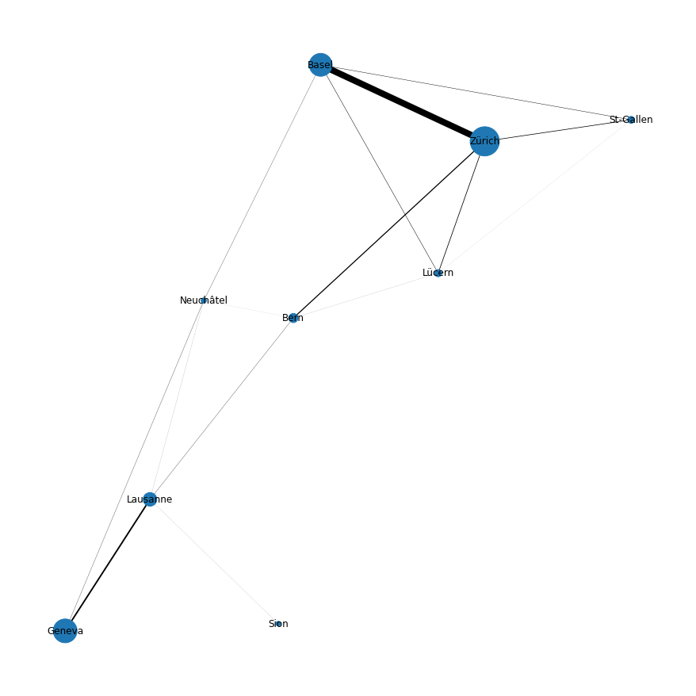
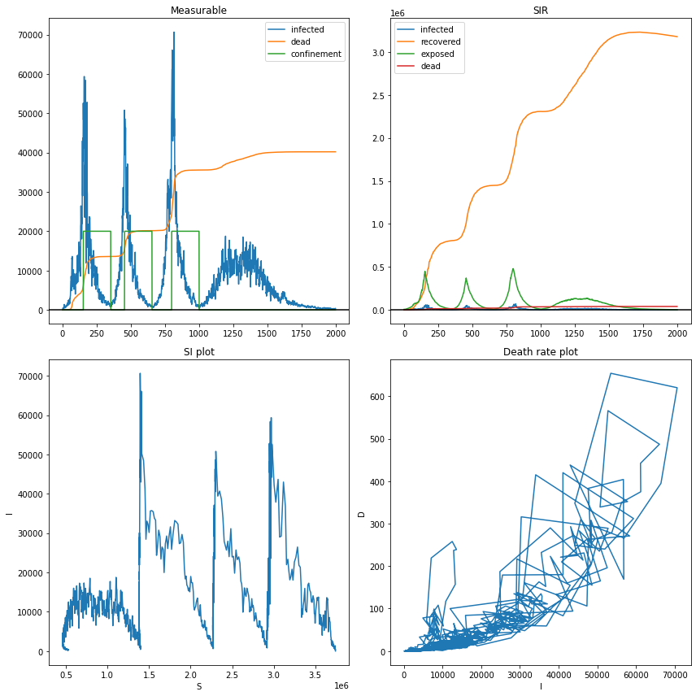

# Artificial Neural Networks : Epidemic Control Project

Building a reinforcement learning environment for training epidemic mitigation policies. (Presumably using Q-learning.)

## Dynamical model design:

We model the epidemic dynamics on a graph representing cities (see Switzerland example above) with the following per-node dynamics (for city $i \in [m]$ for $m$ cities):
$$
\begin{cases}
\dot{s}_i = \gamma_i r_i - \alpha_i s_i(i_i + \sum_{j\neq i} \tau_j i_j ) - \mu \\
\dot{e}_i = \alpha_i s_i(i_i + \sum_{j\neq i} \tau_j i_j ) -\eta_i e_i\\
\dot{i} =  \eta_i e_i - (\beta_i + \zeta_i \cdot i_i) i_i\\
\dot{r} = \beta_i i_i - \gamma_i r_i + \mu \\
\dot{d} = \zeta_i i_i^2 \\
\end{cases}
$$

where the $_i$ subscript denotes the $i$-th city, the variables are the following:
- $s_i$ the proportion of susceptible population
- $e_i$ the proportion of exposed (but not yet infected) population
- $i_i$ the proportion of infected population
- $r_i$ the proportion of recovered population
- $d_i$ the proportion of dead population

the parameters are the following:
- $\alpha_i$ is the transmission rate
- $\eta_i$ is the infection rate
- $\beta_i$ is the recovery rate
- $\zeta_i$ is the death rate
- $\mu$ is the vaccination rate
- $\gamma_i$ is the immunity-loss rate

all of these parameters, are sampled from normal distributions at each time step (the dynamics are stochastic) : $\alpha_i = \mathcal{N}(\bar{\alpha},\sigma_\alpha)$. This leads to epidemic processes which look like that:

Since $s_i + e_i +i_i + r_i +d_i = 1$ the model is a $4\cdot m$-th order model. On the Switzerland graph model that we use this correspond to a $9\cdot 4=36$'th order rate.

## Markov decision process

We choose parameters such that 3 dynamical model integration steps amount to one day. Thus 21 steps amount to one week. We work with a partially observable MDP (POMDP) where the actor can only measure:
- the number of infected people per city (once a day)
- the number of dead people per city (once a day)
- the initial number of people in the country
The hidden variables are the exposed and recovered variables. (**Should we give an approximation of the recovered ?**).

The MDP is defined in such a way that the actor network has to make one decision per week. We define the action space as follows : 
- confinement (per city)
- Isolation (block the in and outgoing roads, per-city)
- pay for exceptional hospital beds (per-city)
- subsidize vaccination (country-wide)

The reward is computed as follows : 

**TODO, describe the reward computation**

## Todos :
- Write a visualization library
- Write a deep Q learning model